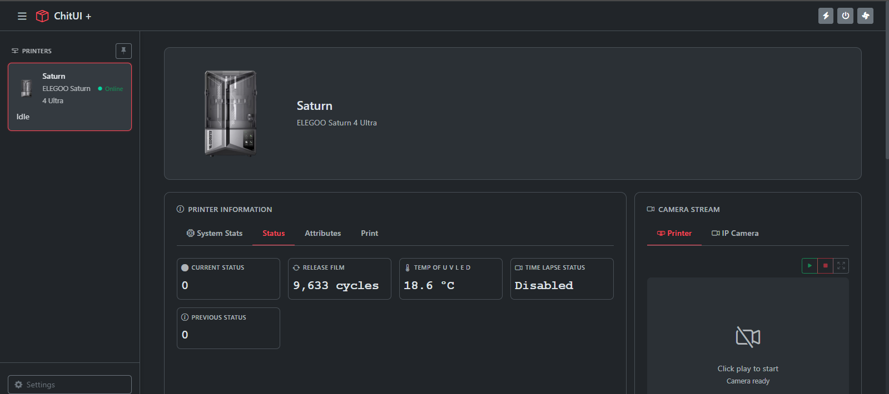
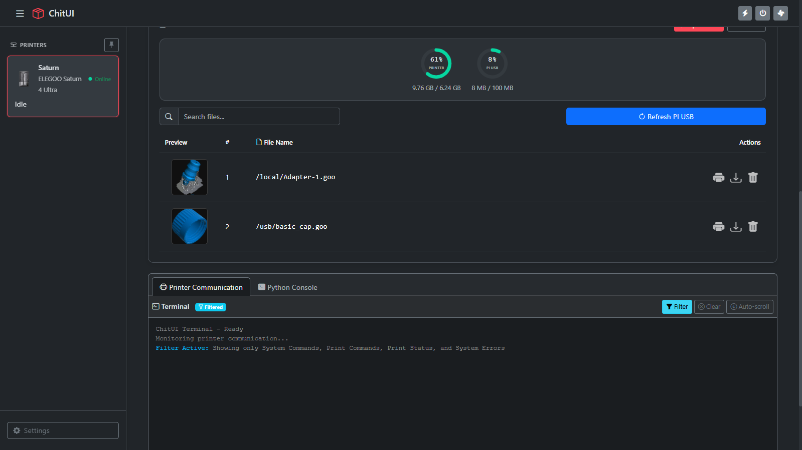

<div align="center">
  

  # ChitUI

  Web-based interface for controlling Chitu-based resin 3D printers with real-time monitoring, file management, theming, and a plugin store.
</div>

## Release Notes

**Version 2.3.0**

*Theme system*
- **UI Themes** — a full theme system in Settings → Appearance. Themes are pure CSS skins installed as ZIPs into `data/themes/` (one folder per theme), with preview images, click-to-enlarge previews, and one-click apply and delete. The login and change-password pages are themed too, and switching back to the built-in default is always one click away.
- **Light & dark per theme** — every theme card has a Light / Dark selector, applied together with the theme.
- **Theme Designer** — a visual editor (desktop browsers) with live preview against the real stylesheet: drag & drop layout re-arranging, per-mode colour palettes, solid / gradient / image backgrounds, icon swapping, and export as an installable ZIP or direct one-click install. Fully offline-capable.
- **Theme development kit** — a downloadable starter template with a documented light + dark scaffold, plus a complete theming guide (`THEMING.md`).
- **Safe theme updates** — re-uploading a theme with the same id updates it in place. Uploads are validated (manifest, size limits, unsafe paths rejected) and installed atomically. Themes can only contain static assets, never executable code.

*Plugin store*
- **Plugin Store** — browse, install and update plugins from within ChitUI. Downloads are proxied server-side, dependencies install automatically, and a live terminal shows pip output during install.
- **Update notifications** — ChitUI checks for plugin updates at startup and every 24 hours, with a banner when new versions are available.
- **Faster startup** — dependency checks use `importlib` to detect already-installed packages before invoking pip.

*Fixes*
- Plugin Store button no longer closes the Settings modal without opening the store.
- Fixed `aria-hidden="true"` preventing the Plugin Store modal from opening.
- Fixed a regex syntax error that silently killed the entire Plugin Store script.
- Plugin downloads are proxied through the Pi, avoiding CORS failures.
- Removed the spurious `Plugin web has no plugin.json` warning on every boot.

**Version 2.2.1**
- UART / serial printer support (Elegoo Mars 2) — *beta*
- Add Printer wizard with connection-type selector
- Improved printer editing modal
- Multi-printer support — *beta*
- Fixed file upload stalls and thumbnail extraction failures

## Features

- **Printer Discovery** — UDP broadcast discovery for network printers, plus manual entry by IP
- **Multi-printer support** — manage several printers from one interface *(beta)*
- **UART / serial printers** — support for printers without network control, such as the Elegoo Mars 2 *(beta)*
- **Real-time Monitoring** — WebSocket status updates over SDCP
- **File Management** — upload and manage files via USB Gadget or network mode
- **Thumbnail Extraction** — automatic thumbnails from `.ctb` and `.goo` files on upload
- **Print Control** — start, pause, resume and stop prints remotely
- **Theme System** — installable CSS themes, light/dark per theme, and a visual Theme Designer
- **Plugin Store** — browse, install and update plugins without leaving the interface
- **Network Configuration** — configure the Pi's network from Settings → Network
- **Raspberry Pi Camera** — native Pi camera streaming alongside the IP Camera plugin
- **User Authentication** — password protection and session management
- **USB Gadget Mode** — the Raspberry Pi appears as a USB drive to the printer

## Screenshots

<div align="center">
  
  <p><em>Main Interface — Printer Monitoring and Control</em></p>

  
  <p><em>Automatic Thumbnail Extraction from Print Files</em></p>
</div>

## Installation

ChitUI should be installed to `~/ChitUI` for best compatibility.

```bash
cd ~
git clone https://github.com/xmodpt/ChitUI.git ChitUI
cd ChitUI
./install.sh
```

The installer will guide you through:

- Installing Python dependencies
- Creating the data directory
- Optional: virtual USB gadget setup
- Optional: auto-start service installation

Then open the web interface:

- Local: `http://localhost:8080`
- Network: `http://<your-pi-ip>:8080`

Default password is `admin`. You will be prompted to change it on first login.

The port can be overridden with the `PORT` environment variable.

## Requirements

**Hardware**
- Raspberry Pi (any model)
- For USB Gadget mode: Pi Zero, Zero W, Zero 2 W, or a Pi 4/5 with OTG support

**Software**
- Raspberry Pi OS (Debian-based)
- Python 3.9 or newer
- Git (recommended)

## Usage

**Installed as a service:**

```bash
sudo systemctl status chitui    # Check status
sudo systemctl restart chitui   # Restart
journalctl -u chitui -f         # Follow logs
```

**Running manually:**

```bash
cd ~/ChitUI
./run.sh
```

## Configuration

Application data lives in the `data/` folder inside the ChitUI directory:

| Path | Contents |
| --- | --- |
| `data/chitui_settings.json` | Settings, printer list, authentication |
| `data/themes/` | Installed themes, one folder each |
| `data/thumbnails/` | Extracted print-file thumbnails |
| `data/uploads/` | Uploaded print files |
| `data/backups/` | Automatic backups taken before plugin updates |

Plugin configuration is stored separately in `~/.chitui/`, so that replacing or
updating a plugin folder never destroys its settings.

Settings from older releases that lived in `~/.chitui/chitui_settings.json` are
migrated automatically on first start.

## Virtual USB Gadget

Makes the Raspberry Pi appear as a USB flash drive when connected to your printer.

1. Run the installer and choose "Yes" for USB Gadget setup
2. Reboot the Pi
3. Connect the Pi's OTG USB port to the printer's USB port
4. Files uploaded through ChitUI appear on the printer

Manual setup and testing:

```bash
cd ~/ChitUI
sudo ./scripts/virtual_usb_gadget_fixed.sh
bash ./scripts/check_usb_gadget.sh
```

## Plugins

Manage plugins under **Settings → Plugins**. You can enable and disable them,
install from the Plugin Store, or upload your own as a `.zip`.


## Themes

Themes are pure CSS skins — they cannot contain executable code. Install them
from **Settings → Appearance**, or build your own:

- Download the starter template from Settings → Appearance
- Read `THEMING.md` for the full guide
- Use the Theme Designer (desktop browsers) for a visual editor with live preview

## Updating

ChitUI can update itself from **Settings → General → Software Updates**, or
manually:

```bash
cd ~/ChitUI
git pull
pip3 install -r requirements.txt --break-system-packages
sudo systemctl restart chitui
```

## Troubleshooting

**Service won't start**

```bash
sudo systemctl status chitui
journalctl -u chitui -n 50
```

**USB Gadget not working**

```bash
bash ~/ChitUI/scripts/check_usb_gadget.sh
```

**Port already in use**

```bash
sudo lsof -i :8080
```

**Printer not discovered**

- Make sure the printer and Pi are on the same subnet — UDP broadcast does not cross subnets
- Check that auto-discovery is enabled in Settings, or add the printer manually by IP
- Some mainboards stop answering discovery while mid-print

## Documentation

- `THEMING.md` — theme development guide
- `scripts/README.md` — script documentation
- `plugins/*/README.md` — plugin-specific guides

## Technology Stack

**Backend:** Python 3, Flask, Flask-SocketIO, Loguru, Pillow, requests, websocket-client

**Frontend:** Bootstrap 5, Socket.IO client, Bootstrap Icons, vanilla JavaScript

## Credits

Based on the original [ChitUI](https://github.com/jangrewe/ChitUI) proof of
concept by **Jan Grewe**.

## Version

**Current version:** 2.3.0

## License

See the [LICENSE](LICENSE) file for details.

## Support

For issues, questions or contributions, please use the
[project repository](https://github.com/xmodpt/ChitUI).
